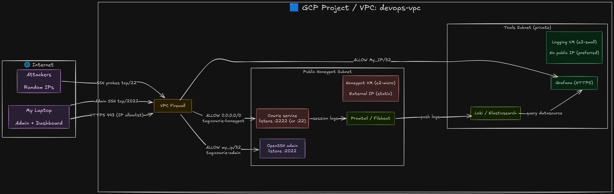

# GCP SOC Lab: Automated Threat Intelligence

This project demonstrates infrastructure isolation, secure log aggregation, and real-time threat monitoring using industry-standard DevOps tools. This repository contains the Infrastructure as Code (IaC) and configuration management to deploy a fully functional SOC lab on Google Cloud Platform. 

## Architecture Overview
- Public Cowrie honeypot VM (`cowrie-1`) acting as an SSH/Telnet trap on the public internet
- Private logging VM (`logging-1`) running Loki + Grafana with No Public IP
- Promtail agent shipping JSON logs over the internal GCP VPC network to Loki
- Optional Cloudflare Tunnel (`cloudflared`) for secure dashboard access without opening inbound ports

## Tech Stack 

- Cloud: Google Platform (VPC, Compute Engine, Firewall, Cloud NAT)
- Provisioning: Terraform (HCL)
- Configuration: Ansible
- Secrets: Mozilla SOPS + Age
- Observability: Grafana, Loki, Promtail
- Security: Cowrie, Cloudflare Tunnel

## Technical Challenges & Solutions

### The "Invisible" Logging Node Challenge
- **The Problem**: I wanted the logging VM to have **no public IP address** to maximize security. However, this initially made it impossible for Ansible to configure the node and prevented the node from downloading Loki/Grafana updates.

- **The Solution**: I implemented a GCP Cloud NAT and a CLoud Router via Terraform. This allowed the private VM to initiate outbound requests for updates while unreachable from the public internet. 

### Log Ingestion Over Internal VPC
- **The Problem**: Shipping logs from the "Public subnet to the "Private" subnet required precise firewall rules without exposing the logging stack.

- **The Solution**: I architected strict ingress rules on the Tools Subnet that only allow traffic on port `3100` (Loki) specifically from the Honeypot's internal IP. This prevents "pivoting" attacks if the honeypot is compromised.

### Handling Cowrie's Multi-Port Networking
- **The Problem**: Cowrie listens on port `2222`, but attackers look for port 22. Simply changing the listener port often breaks standard SSH access for the admin.

- **The Solution**: I used Ansible to automate a non-standard SSH configuration for the host (moving real SSH to 2022) and used iptables to transparently redirect all incoming traffic on `22` to Cowrie's `2222`.

## Architecture

- VPC: custom network with isolated subnets
- Honeypot path: Internet -> GCP firewall (`tcp/22`) -> Cowrie
- Admin path: your IP -> GCP firewall (`tcp/2022`) -> real SSH
- Logging path: Cowrie JSON logs -> Promtail -> Loki -> Grafana

See [docs/architecture.md](docs/architecture.md) for details.

## Quick Start

1. Create your infra config:
   - secure path (recommended): follow [docs/secrets-management.md](docs/secrets-management.md)
   - legacy path: copy `terraform/terraform.tfvars.example` to `terraform/terraform.tfvars`
2. Provision infra:
   - `cd terraform`
   - `terraform init`
   - `terraform plan`
   - `terraform apply`
3. Configure Ansible values:
   - update `ansible/group_vars/all.yml`
   - update `ansible/inventory/hosts.ini`
4. Run Ansible:
   - `cd ../ansible`
   - `ansible-playbook playbooks/site.yml`

## Cloudflare Tunnel (Optional)

To publish Grafana at your own domain without opening inbound ports on VM2:

1. Create a Cloudflare Tunnel and public hostname.
2. Set service target to `http://localhost:443`.
3. Provide token via environment variable:
   - copy `ansible/group_vars/.env.example` to `ansible/group_vars/.env`
   - set `cloudflared_tunnel_token`
4. Run:
   - `ansible-playbook playbooks/05-cloudflared.yml -e cloudflared_enabled=true`

## Secure Secrets Workflow (Recommended)

- Bootstrap encrypted files:
  - `cp terraform/terraform.sops.tfvars.json.example terraform/terraform.sops.tfvars.json`
  - `cp ansible/group_vars/secrets.sops.yml.example ansible/group_vars/secrets.sops.yml`
  - `sops -e -i terraform/terraform.sops.tfvars.json ansible/group_vars/secrets.sops.yml`
- Run Terraform with decrypted temp vars only:
  - `./scripts/terraform-sops.sh plan`
- Run Ansible with decrypted temp vars only:
  - `./scripts/ansible-playbook-sops.sh playbooks/site.yml`
- Full setup: [docs/secrets-management.md](docs/secrets-management.md)

## Demo Scope & Security Notes

This project was developed as part of my practical application while studying, focusing on Cloud Infrastructure and Security automation. This repo is intended as an educational/demonstration lab, not a production SOC platform.

**Security (Recommended)**: Do not commit `terraform.tfvars`, `.tfstate`, `.env` files. Restrict admin SSH (`tcp/2022`) to your `/32` IP. Use encrypted secrets files with `age + sops` via [docs/secrets-management.md](docs/secrets-management.md).
